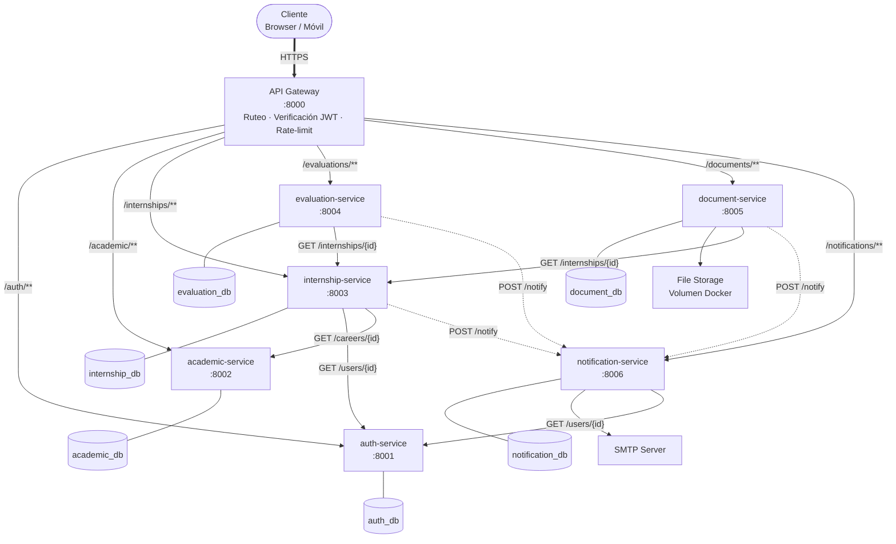
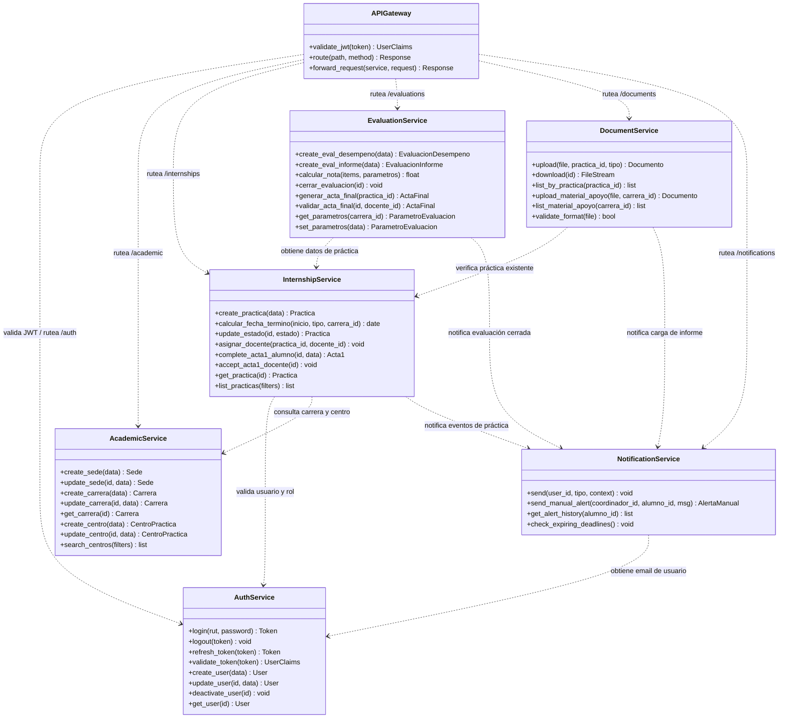

# Diagrama de Clases con los Microservicios

> **Stack:** Python · FastAPI · PostgreSQL · Docker  
> **Base:** SRS Caso 13 — Sistema de Gestión de Prácticas Laborales y Profesionales.

---

## Topología de Servicios

> Las flechas sólidas representan dependencias directas (HTTP síncrono). Las flechas punteadas representan disparos de eventos hacia el servicio de notificaciones.

---

## Diagrama de Clases — Servicios y sus Operaciones

---

## Diagrama de Clases — Modelos de Dominio por Servicio

```mermaid
classDiagram
    namespace auth_service {
        class User {
            +id : UUID
            +rut : str
            +nombre : str
            +apellido : str
            +email : str
            +password_hash : str
            +rol : RolEnum
            +carrera_id : UUID
            +is_active : bool
            +created_at : datetime
        }
        class RolEnum {
            <<enumeration>>
            SUPER_ADMIN
            JEFE_CARRERA
            COORDINADOR
            DOCENTE
            ALUMNO
            EMPLEADOR
        }
    }

    namespace academic_service {
        class Sede {
            +id : UUID
            +nombre : str
            +is_active : bool
        }
        class Carrera {
            +id : UUID
            +nombre : str
            +sede_id : UUID
            +horas_laboral : int
            +horas_profesional : int
            +is_active : bool
        }
        class CentroPractica {
            +id : UUID
            +nombre : str
            +giro : str
            +nombre_gerente : str
            +telefono : str
            +correo : str
            +nombre_contacto : str
            +correo_contacto : str
            +direccion : str
            +is_active : bool
        }
    }

    namespace internship_service {
        class Practica {
            +id : UUID
            +alumno_id : UUID
            +coordinador_id : UUID
            +docente_id : UUID
            +carrera_id : UUID
            +centro_practica_id : UUID
            +tipo : TipoPracticaEnum
            +estado : EstadoPracticaEnum
            +fecha_inicio : date
            +fecha_termino_calculada : date
            +fecha_termino_confirmada : date
            +created_at : datetime
        }
        class Acta1 {
            +id : UUID
            +practica_id : UUID
            +direccion_centro : str
            +departamento : str
            +nombre_jefe_directo : str
            +cargo_jefe_directo : str
            +contacto_correo : str
            +contacto_telefono : str
            +practica_a_distancia : bool
            +tareas_principales : str
            +foto_url : str
            +completada_alumno : bool
            +aceptada_docente : bool
            +fecha_limite_alumno : date
        }
        class TipoPracticaEnum {
            <<enumeration>>
            LABORAL
            PROFESIONAL
        }
        class EstadoPracticaEnum {
            <<enumeration>>
            PENDIENTE
            EN_CURSO
            FINALIZADA
            ANULADA
        }
    }

    namespace evaluation_service {
        class EvaluacionDesempeno {
            +id : UUID
            +practica_id : UUID
            +evaluador_id : UUID
            +tipo_evaluador : TipoEvaluadorEnum
            +items : JSON
            +nota : float
            +estado : EstadoEvalEnum
        }
        class EvaluacionInforme {
            +id : UUID
            +practica_id : UUID
            +docente_id : UUID
            +items : JSON
            +nota : float
            +estado : EstadoEvalEnum
        }
        class ActaFinal {
            +id : UUID
            +practica_id : UUID
            +nota_informe : float
            +nota_empleador : float
            +nota_final : float
            +validada_por : UUID
            +validada_en : datetime
        }
        class ParametroEvaluacion {
            +id : UUID
            +carrera_id : UUID
            +pct_informe : float
            +pct_empleador : float
        }
        class TipoEvaluadorEnum {
            <<enumeration>>
            DOCENTE
            EMPLEADOR
        }
        class EstadoEvalEnum {
            <<enumeration>>
            BORRADOR
            CERRADA
        }
    }

    namespace document_service {
        class Documento {
            +id : UUID
            +practica_id : UUID
            +nombre : str
            +tipo : TipoDocEnum
            +url : str
            +tamanio_kb : int
            +subido_por : UUID
            +created_at : datetime
        }
        class TipoDocEnum {
            <<enumeration>>
            INFORME_PRACTICA
            MATERIAL_APOYO
            ACTA_EVALUACION
        }
    }

    namespace notification_service {
        class Notificacion {
            +id : UUID
            +user_id : UUID
            +tipo : TipoNotifEnum
            +mensaje : str
            +enviada : bool
            +created_at : datetime
        }
        class AlertaManual {
            +id : UUID
            +coordinador_id : UUID
            +alumno_id : UUID
            +asunto : str
            +mensaje : str
            +created_at : datetime
        }
        class TipoNotifEnum {
            <<enumeration>>
            ACTA1_DISPONIBLE
            ACTA1_VENCE_MANANA
            DOCENTE_ASIGNADO
            INFORME_CARGADO
            PRACTICA_PROXIMA_VENCER
            EVALUACION_CERRADA
            PRACTICAS_SIN_CERRAR
        }
    }

    %% Relaciones internas auth_service
    User --> RolEnum : tiene

    %% Relaciones internas academic_service
    Sede "1" *-- "*" Carrera : contiene

    %% Relaciones internas internship_service
    Practica "1" *-- "1" Acta1 : compone
    Practica --> TipoPracticaEnum : clasifica
    Practica --> EstadoPracticaEnum : tiene estado

    %% Relaciones internas evaluation_service
    EvaluacionDesempeno --> TipoEvaluadorEnum : tipo
    EvaluacionDesempeno --> EstadoEvalEnum : estado
    EvaluacionInforme --> EstadoEvalEnum : estado
    ActaFinal "1" o-- "1" EvaluacionDesempeno : agrega nota
    ActaFinal "1" o-- "1" EvaluacionInforme : agrega nota
    ParametroEvaluacion ..> ActaFinal : aplica ponderación

    %% Relaciones internas document_service
    Documento --> TipoDocEnum : tipo

    %% Relaciones internas notification_service
    Notificacion --> TipoNotifEnum : tipo
```

