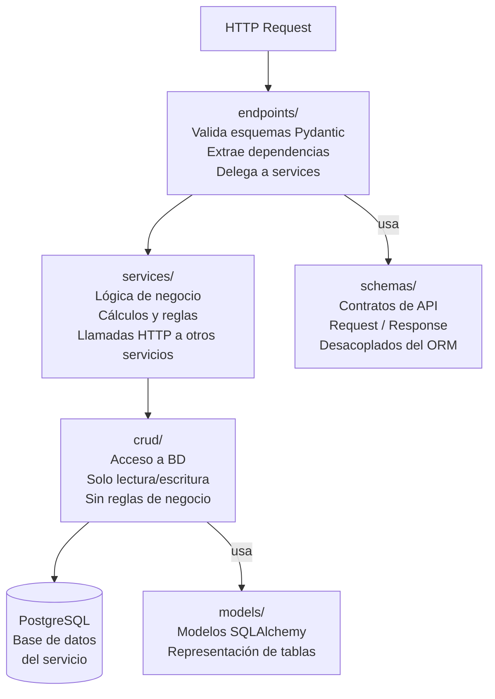

# Estructura de Microservicio

> Estructura estándar aplicada a **todos los servicios** del sistema.  
> Stack: Python · FastAPI · SQLAlchemy · Alembic · PostgreSQL · Docker.

---

## Estructura de directorios — Servicios de dominio

Aplica a: `auth-service`, `academic-service`, `internship-service`, `evaluation-service`, `document-service`, `notification-service`.

```
{service-name}/
├── app/
│   ├── main.py                  # Instancia FastAPI, lifespan hooks, middlewares globales
│   ├── core/
│   │   ├── config.py            # Settings con pydantic-settings (variables de entorno)
│   │   └── security.py          # Decode/verify JWT — sólo auth-service lo genera
│   ├── api/
│   │   └── v1/
│   │       ├── router.py        # Agrega todos los sub-routers del servicio
│   │       └── endpoints/
│   │           └── *.py         # Un archivo por recurso: practica.py, acta.py, ...
│   ├── models/
│   │   └── *.py                 # Modelos SQLAlchemy (tablas)
│   ├── schemas/
│   │   └── *.py                 # Esquemas Pydantic: Request / Response / internal
│   ├── crud/
│   │   └── *.py                 # Operaciones CRUD sobre la BD, sin lógica de negocio
│   ├── services/
│   │   └── *.py                 # Lógica de negocio, cálculos, llamadas HTTP a otros servicios
│   └── db/
│       ├── base.py              # Base declarativa SQLAlchemy
│       └── session.py           # SessionLocal, dependencia get_db
├── tests/
│   ├── conftest.py
│   └── test_*.py
├── Dockerfile
├── requirements.txt
└── .env.example
```

---

## Estructura de directorios — API Gateway

El gateway **no tiene acceso a base de datos propia** ni lógica de negocio.

```
api-gateway/
├── app/
│   ├── main.py           # FastAPI app con rutas de proxy
│   ├── core/
│   │   ├── config.py     # URLs de servicios internos, clave pública JWT
│   │   └── security.py   # Verificación JWT (no genera tokens)
│   ├── middleware/
│   │   ├── auth.py       # Middleware de verificación de token en cada request
│   │   └── rate_limit.py # Rate limiting simple por user_id
│   └── proxy/
│       └── router.py     # Reverse proxy con httpx por servicio destino
├── Dockerfile
└── requirements.txt
```

---

## Rol de cada capa interna



| Capa | Rol |
| :--- | :--- |
| `endpoints/` | Entrada HTTP: valida esquemas Pydantic, extrae dependencias (`Depends`), delega a `services/`. No contiene lógica de negocio. |
| `services/` | Lógica de negocio y orquestación. Aquí viven los cálculos (e.g., fecha de término) y las llamadas HTTP a otros servicios. |
| `crud/` | Acceso a la BD mediante SQLAlchemy. Solo operaciones de lectura/escritura, sin reglas de negocio. |
| `schemas/` | Contratos de API (entrada y salida). Desacoplados de los modelos ORM para no exponer el schema interno de la BD. |
| `models/` | Representación de tablas en PostgreSQL mediante SQLAlchemy. |
| `core/config.py` | Todas las variables de entorno vía `pydantic-settings`. Nunca se hardcodean URLs, claves ni credenciales. |

---

## Ejemplo — internship-service

```
internship-service/
├── app/
│   ├── main.py
│   ├── core/
│   │   ├── config.py
│   │   └── security.py
│   ├── api/
│   │   └── v1/
│   │       ├── router.py
│   │       └── endpoints/
│   │           ├── practica.py    # CRUD de prácticas, cambios de estado
│   │           └── acta.py        # Completar / aceptar Acta 1
│   ├── models/
│   │   ├── practica.py            # Tabla practicas
│   │   └── acta1.py               # Tabla actas_1
│   ├── schemas/
│   │   ├── practica.py            # PracticaCreate, PracticaResponse, ...
│   │   └── acta.py                # Acta1Update, Acta1Response, ...
│   ├── crud/
│   │   ├── practica.py
│   │   └── acta.py
│   ├── services/
│   │   ├── practica_service.py    # calcular_fecha_termino(), asignar_docente(), ...
│   │   └── clients.py             # httpx calls → auth-service, academic-service, notification-service
│   └── db/
│       ├── base.py
│       └── session.py
├── tests/
│   ├── conftest.py
│   ├── test_practica.py
│   └── test_acta.py
├── Dockerfile
├── requirements.txt
└── .env.example
```
