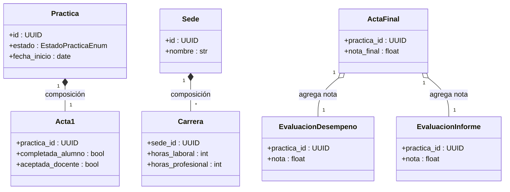
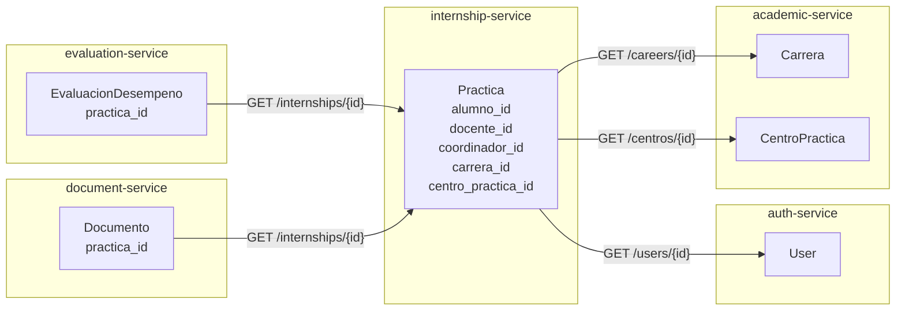
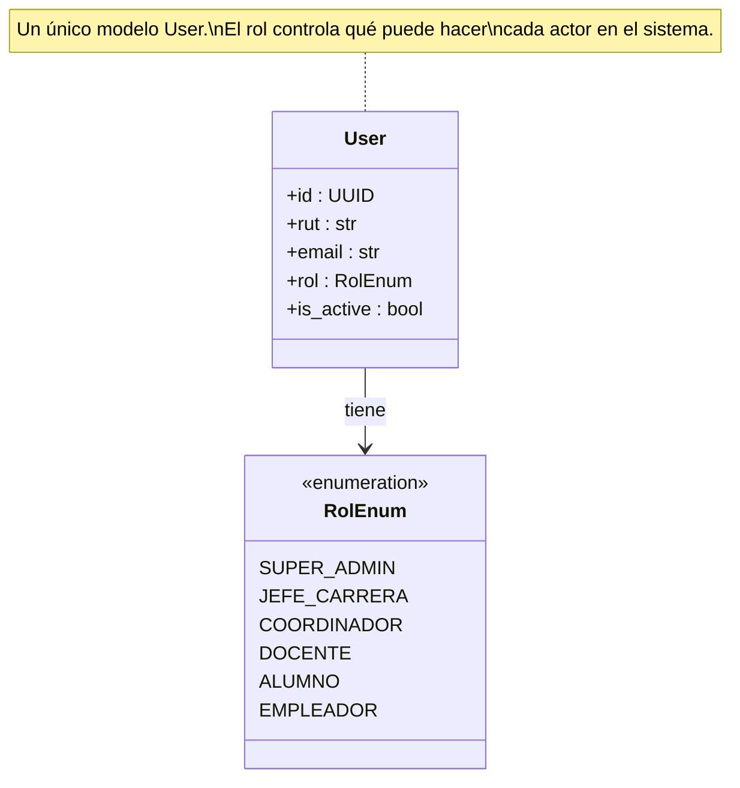

# Relaciones, Composición y Herencia

> **Base:** SRS Caso 13 — Sistema de Gestión de Prácticas Laborales y Profesionales.

---

## Composición (ciclo de vida compartido)

La composición implica que el componente **no puede existir sin su contenedor**. Si el contenedor desaparece, el componente también.

| Contenedor | Componente | Justificación |
| :--- | :--- | :--- |
| `Practica` | `Acta1` | El Acta 1 no existe sin una práctica. Se crea junto a ella y se invalida si la práctica es anulada. |
| `Sede` | `Carrera` | Las carreras pertenecen a una sede. Si una sede se da de baja lógica, sus carreras quedan inactivas. |
| `ActaFinal` | `EvaluacionDesempeno` + `EvaluacionInforme` | El acta final agrega ambas evaluaciones para producir la nota final; las contiene conceptualmente como agregación fuerte. |

---

## Asociaciones entre servicios (referencias por UUID)

Como cada microservicio tiene su propia base de datos, **no existen foreign keys entre servicios**. Las relaciones cross-service se expresan como UUIDs que se resuelven en tiempo de ejecución mediante llamadas HTTP.

| Entidad | Campo | Propietario del ID | Endpoint consultado |
| :--- | :--- | :--- | :--- |
| `Practica` | `alumno_id` | `auth-service` | `GET /users/{id}` |
| `Practica` | `docente_id` | `auth-service` | `GET /users/{id}` |
| `Practica` | `coordinador_id` | `auth-service` | `GET /users/{id}` |
| `Practica` | `carrera_id` | `academic-service` | `GET /careers/{id}` |
| `Practica` | `centro_practica_id` | `academic-service` | `GET /centros/{id}` |
| `EvaluacionDesempeno` | `practica_id` | `internship-service` | `GET /internships/{id}` |
| `Documento` | `practica_id` | `internship-service` | `GET /internships/{id}` |

---

## Herencia

No se aplica herencia de clases en los modelos de dominio. Decisión explícita:

### Polimorfismo por rol (en lugar de subclases)

`User` tiene un campo `rol: RolEnum`. El control de acceso se gestiona mediante los claims del JWT y se verifica en cada endpoint con dependencias de FastAPI (`Depends`).

No hay subclases `Alumno`, `Docente`, `Coordinador`, etc., para evitar la complejidad del patrón *table-per-hierarchy* en SQLAlchemy.

### Evaluaciones separadas (en lugar de herencia)

`EvaluacionDesempeno` y `EvaluacionInforme` son entidades independientes, no subclases de una `Evaluacion` base. Aunque comparten la misma estructura de ítems en JSON, sus flujos de validación y los actores que las completan son distintos — empleador vs. docente — por lo que la separación explícita es más clara y mantenible que la herencia.

| Decisión | Alternativa descartada | Motivo |
| :--- | :--- | :--- |
| `User` con campo `rol` | Subclases `Alumno`, `Docente`, etc. | Evita *table-per-hierarchy* en SQLAlchemy sin beneficio real para este alcance |
| Entidades de evaluación separadas | Clase base `Evaluacion` con herencia | Los actores y flujos son distintos; la herencia añadiría acoplamiento innecesario |
